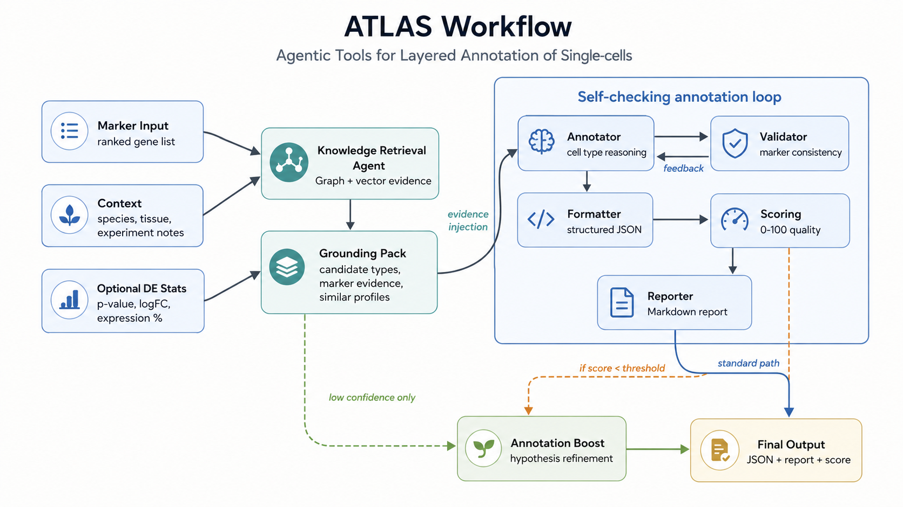

# ATLAS — Agentic Tools for Layered Annotation of Single-cells

<p align="center">
  
  
  
  
</p>

**ATLAS** is a modular multi-agent LLM framework for interpretable single-cell RNA-seq cell type annotation. 

Given a ranked marker gene list and basic biological context, ATLAS produces structured cell type annotations, confidence-aware quality scores, and a human-readable report.

<details>
<summary>🇨🇳 中文</summary>

**ATLAS** 是一个用于可解释单细胞 RNA-seq 细胞类型注释的模块化多智能体（multi-agent）LLM 框架。
给定一个排序后的 marker 基因列表和基本生物学背景，ATLAS 会输出结构化的细胞类型注释、带置信度的质量分数，以及一份人类可读的报告。

</details>
---

## ✨ Key Features

- **Multi-agent annotation workflow**  — reasoning, validation, formatting, scoring, and reporting agents.
- **Hybrid biological grounding** (scRAG) — structured triples from knowledge graphs + similar cells from a vector index.
- **Iterative self-checking** — validates marker–cell type consistency and revises uncertain annotations (≤ 3 cycles).
- **Quality-aware refinement** — triggers an Annotation Boost agent only when the score falls below a threshold.
- **Marker-gene refinement** — candidate and similar cell types are confirmed against marker overlap before the final call.
- **Provider-agnostic LLM interface** — OpenAI, Anthropic, OpenRouter, and custom backends, with per-agent model overrides.
- **Offline smoke tests** — mock LLM tests validate orchestration logic without API calls or cost.

<details>
<summary>🇨🇳 中文：核心特性</summary>

- **多智能体注释流程**：推理、校验、格式化、打分、报告等智能体。
- **混合生物学 grounding**（scRAG ）：知识图谱的结构化三元组 + 向量索引的相似细胞。
- **迭代自校验**：检查 marker 与细胞类型一致性，对不确定注释进行修正（≤ 3 轮）。
- **质量感知的精修**：仅当分数低于阈值时才触发 Annotation Boost 智能体。
- **Marker 基因精修**：在给出最终结论前，用 marker 重叠度对候选与相似细胞类型进行确认。
- **provider 无关的 LLM 接口**：支持 OpenAI、Anthropic、OpenRouter 及自定义后端，可按 agent 覆盖模型。
- **离线冒烟测试**：用 mock LLM 验证编排逻辑，无需 API 调用、无费用。

</details>

---

## 🧬 The 7 Agents

ATLAS coordinates seven agents into a self-checking annotation pipeline. Most are LLM-driven; the Reporter is deterministic rendering.

| # | Agent | LLM? | What it does |
|---|---|:---:|---|
| 1 | **Annotator** | ✅ | Chain-of-thought reasoning over the marker list to propose a cell type + ranked subtypes. |
| 2 | **Validator** | ✅ | Checks marker–cell type consistency, requests revision if needed (≤ 3 cycles). |
| 3 | **Formatter** | ✅ | Converts free-text annotation into strict JSON. |
| 4 | **Scoring** | ✅ | Assigns a 0–100 quality score based on marker balance and scientific accuracy. |
| 5 | **Reporter** | ❌ | Renders the full conversation into a styled report. |
| 6 | **Annotation Boost** *(optional)* | ✅ | ReAct loop: hypothesize → query marker statistics → refine. Rescues low-confidence cases. |
| 7 | **scRAG** *(optional)* | ✅ | Retrieves structured triples (KG) + similar cells (vector index), then refines with marker genes. |

<details>
<summary>🇨🇳 中文：7 个智能体</summary>

| # | 智能体 | 用 LLM？ | 职责 |
|---|---|:---:|---|
| 1 | **Annotator** | ✅ | 对 marker 列表进行链式思维推理，提出细胞类型与排序后的亚型。 |
| 2 | **Validator** | ✅ | 检查 marker 与细胞类型一致性，必要时请求修正（≤ 3 轮）。 |
| 3 | **Formatter** | ✅ | 将自由文本注释转换为严格 JSON。 |
| 4 | **Scoring** | ✅ | 基于 marker 平衡度与科学准确性给出 0–100 质量分数。 |
| 5 | **Reporter** | ❌ | 将完整对话渲染为带样式的报告。 |
| 6 | **Annotation Boost**（可选） | ✅ | ReAct 循环：提出假设 → 查询 marker 统计 → 精修。挽救低置信度案例。 |
| 7 | **scRAG**（可选） | ✅ | 检索结构化三元组（KG）+ 相似细胞（向量索引），再用 marker 基因精修。 |

</details>

---

## 🏗️ Architecture



<details>
<summary>Text version of the workflow · 工作流文字版</summary>

```text
Ranked marker gene input
        |
        |----> Hybrid RAG Agent (scRAG-style)
        |      KG triples (LOCATED_IN / EXPRESSED_IN) + vector top-k similar cells
        |      -> candidate cell types -> marker-gene refinement
        |      Evidence injected into the annotation context
        |
        v
+---------------- Self-checking annotation loop (CASSIA-style) -----+
|                                                                   |
|   Annotator <---- feedback ---- Validator                         |
|       |                         marker consistency check (<=3x)   |
|       v                                                           |
|   Formatter  ----> structured JSON                                |
|       |                                                           |
|       v                                                           |
|   Scoring    ----> 0-100 quality score                            |
|       |                                                           |
|       v                                                           |
|   Reporter   ----> styled report                                 |
|                                                                   |
+-------------------------------------------------------------------+
        |
        |---- if score < threshold
        v
Annotation Boost Agent
Hypothesis generation + evidence-based refinement
```

</details>

---

## 🔍 Hybrid Retrieval Grounding (scRAG)

LLMs often lack specialized knowledge about genes and tissues, which hurts annotation when the query crosses tissue contexts. Following **scRAG**, ATLAS's optional Hybrid RAG agent supplies that knowledge from external sources instead of relying on the model's priors. It runs in three steps:

**1 · Structured retrieval (knowledge graph).** Two graphs are built in Neo4j from a reference set of cell sentences and queried for triples:

- `Cell type — LOCATED_IN → Tissue`
- `Gene — EXPRESSED_IN → Cell type`

Redundant triples are merged into compact non-redundant entries. Triples (not verbose sentences) are used as the prompt format, which scRAG found more accurate.

**2 · Unstructured retrieval (vector index).** Each query cell is encoded as a "cell sentence" (its top-100 expressed genes + tissue). Cosine similarity retrieves the **top-4 similar cells** from the reference database; their labels become *similar cell types*.

**3 · Candidate generation + marker-gene refinement.** The LLM fuses the triples and similar cell types to propose **top-2 candidate cell types**, then confirms the final call by checking marker-gene overlap between the query and the candidate / similar cell types.

> Defaults (`top-k similar = 4`, `candidates = 2`) follow scRAG's ablation optima. Knowledge sources combine **CellMarker 2.0** (markers, from scRAG) with **Cell Ontology** normalization (from CASSIA) — see Acknowledgements.

<details>
<summary>🇨🇳 中文：混合检索 Grounding（scRAG）</summary>

LLM 往往缺乏关于基因与组织的专业知识，跨组织注释时尤其吃亏。ATLAS 用可选的 Hybrid RAG agent 从外部知识源补充这些知识，而非依赖模型先验。分三步：

**1 · 结构化检索（知识图谱）**：在 Neo4j 中由参考 cell sentence 构建两张图谱，查询三元组：

- `Cell type — LOCATED_IN → Tissue`
- `Gene — EXPRESSED_IN → Cell type`

冗余三元组会被合并为紧凑条目。使用三元组（而非冗长自然语言句）作为 prompt 格式——scRAG 发现这样更准。

**2 · 非结构化检索（向量索引）**：每个 query 细胞编码为"cell sentence"（top-100 高表达基因 + 组织），用余弦相似度检索**top-4 相似细胞**，其标签作为*相似细胞类型*。

**3 · 候选生成 + marker 基因精修**：LLM 融合三元组与相似细胞类型，提出**top-2 候选细胞类型**，再通过比对 query 与候选/相似细胞类型的 marker 基因重叠度确认最终结论。

> 默认值（`top-k 相似 = 4`、`候选 = 2`）取自 scRAG 的消融最优。知识源结合 **CellMarker 2.0**（marker，来自 scRAG）与 **Cell Ontology** 标准化（来自 CASSIA）——见致谢。

</details>

---

## 🚀 Quick Start

```bash
git clone https://github.com/<your-username>/ATLAS.git
cd ATLAS
pip install -r requirements.txt
cp .env.example .env   # then add your API keys
```

```python
from atlas import annotate_cluster

result = annotate_cluster(
    marker_list=["CD3D", "CD3E", "CD8A", "IL7R", "CCL5"],
    tissue="blood",
    species="Human",
    model="anthropic/claude-sonnet-4.6",
    provider="openrouter",
)

print(result["result"]["main_cell_type"])  # T cell
print(result["result"]["sub_cell_type"])   # CD8+ memory T cell
print(result["score"])                     # 91
```

<details>
<summary>🇨🇳 中文：快速开始</summary>

克隆仓库、安装依赖、复制 `.env.example` 为 `.env` 并填入 API key，然后运行上面的 `annotate_cluster` 即可得到注释结果、亚型与质量分数。

</details>

---

## 📊 Validated Performance

The following results were obtained by running the repository test suite on publicly available single-cell RNA-seq benchmark datasets.
| Test case | Outcome | Score | Notes |
|---|---|:---:|---|
| Clean CD8+ T cell (clear markers) | ✅ Correct | 92/100 | Baseline 4-agent pipeline |
| CD8+ T cell + RAG augmentation | ✅ Finer subtypes | 95/100 | Hybrid retrieval adds T-cell axes |
| Plasma cell (housekeeping-dominated markers) | ✅ Correct | 78/100 | Annotator sees past noise |
| **Monocyte (paper Fig 6b error case)** | ✅ **Identified gold-standard error** | 68/100 | Boost agent confirms enteric glial cells |
| Mixed T + B cell | ✅ Mixed population flagged | — | — |

All results are reproducible — see [`docs/REPRODUCTION.md`](docs/REPRODUCTION.md).

<details>
<summary>🇨🇳 中文：验证性能</summary>

以下是本仓库测试套件公开单细胞 RNA 测序基准数据集上跑出的真实结果：

| 测试用例 | 结果 | 分数 | 备注 |
|---|---|:---:|---|
| 干净 CD8+ T 细胞（marker 清晰） | ✅ 正确 | 92/100 | 基线 4-agent 流程 |
| CD8+ T 细胞 + RAG 增强 | ✅ 更细亚型 | 95/100 | 混合检索补充 T 细胞分类轴 |
| 浆细胞（管家基因主导 marker） | ✅ 正确 | 78/100 | Annotator 越过噪声识别 |
| **单核细胞（论文 Fig 6b 错误案例）** | ✅ **识别出金标准错误** | 68/100 | Boost agent 确认为肠神经胶质细胞 |
| 混合 T + B 细胞 | ✅ 标记出混合群体 | — | — |

所有结果均可复现 —— 见 [`docs/REPRODUCTION.md`](docs/REPRODUCTION.md)。

</details>

---

## 💰 Cost Reference

Measured on real runs (OpenRouter pricing):

| Pipeline | LLM calls | Typical cost | Use when |
|---|:---:|:---:|---|
| 3-agent (no Scoring) | 3 | ~$0.04 | Fast prototyping |
| 4-agent core (default) | 4 | ~$0.04 | Standard annotation |
| 4-agent + Boost | +5–9 | +$0.10 | Score < 75 clusters |
| 4-agent + Hybrid RAG | +1 | +$0.05 | Cross-tissue / under-studied tissue |
| Full (4-agent + Boost + RAG) | up to 14 | ~$0.20 | Maximum confidence |

**Optimization tip:** Scoring and Formatter can run on cheaper models (e.g. DeepSeek v3, Gemini Flash); only Annotator / Validator / Boost need a strong model like Claude Sonnet. Override any model per-agent via the `*_model=` kwargs.

<details>
<summary>🇨🇳 中文：成本参考</summary>

基于真实运行测量（OpenRouter 计价）：

| 流程 | LLM 调用 | 典型成本 | 适用场景 |
|---|:---:|:---:|---|
| 3-agent（无 Scoring） | 3 | ~$0.04 | 快速原型 |
| 4-agent 核心（默认） | 4 | ~$0.04 | 标准注释 |
| 4-agent + Hybrid RAG | +1 | +$0.05 | 跨组织 / 研究较少的组织 |
| 4-agent + Boost | +5–9 | +$0.10 | 分数 < 75 的 cluster |
| 完整（4-agent + Boost + RAG） | 最多 14 | ~$0.20 | 追求最高置信度 |

**优化建议**：Scoring 与 Formatter 可用更便宜的模型（如 DeepSeek v3、Gemini Flash）；只有 Annotator / Validator / Boost 需要强模型。可通过 `*_model=` 参数按 agent 覆盖模型。

</details>

---

## ⚡ Annotation Boost

```python
result = annotate_cluster(
    marker_list=["EPCAM", "KRT8", "KRT18", "MKI67", "TOP2A"],
    tissue="colon",
    species="Human",
    use_annotation_boost=True,
    boost_threshold=75,
)
```

When the initial score is below the threshold, the Boost agent generates alternative hypotheses, checks marker support for each, compares competing interpretations, and updates the annotation if stronger evidence is found.

---

## 🔍 Enable Hybrid Retrieval

```python
from atlas.retrieval import HybridRetriever, make_entity_extractor
from atlas.agents import HybridRAGAgent
from atlas import annotate_cluster

retriever = HybridRetriever(
    graph=graph,                       # Neo4j: Tissue-CellType + Gene-CellType graphs
    vector_index=vector_index,         # cell-sentence embeddings
    entity_extractor=make_entity_extractor(),
    top_k_similar=4,                   # scRAG default
    top_k_candidates=2,                # scRAG default
)

result = annotate_cluster(
    marker_list=["SST", "SERPINA1", "GNAS", "PCSK1N", "RBP4"],
    tissue="pancreas",
    species="Human",
    rag_agent=HybridRAGAgent(retriever),
)
```

The retrieved triples and similar-cell evidence are injected into the annotation context **before** the Annotator predicts, then candidates are confirmed via marker-gene overlap.

---

## 📦 Output Format

```python
{
    "result": {
        "main_cell_type": "T cell",
        "sub_cell_type": "CD8+ memory T cell",
        "possible_mixed_population": False,
        "supporting_markers": ["CD3D", "CD3E", "CD8A", "CCL5"],
        "negative_evidence": [],
        "reasoning_summary": "The marker profile supports a T lineage identity..."
    },
    "score": 91,
    "validation": {"passed": True, "issues": []},
    "grounding": {
        "graph_triples": [...],        # LOCATED_IN / EXPRESSED_IN
        "similar_cells": [...],        # top-4
        "candidates": [...]            # top-2
    },
    "report": "..."
}
```

---

## 📁 Directory Structure

```text
atlas/
├── core/
│   ├── llm.py                  # Unified LLM gateway
│   └── agent.py                # Shared agent base class
├── agents/
│   ├── prompts.py              # System prompts and templates
│   ├── core_agents.py          # Annotator, Validator, Formatter, Scoring, Reporter
│   ├── annotation_boost.py     # Low-confidence refinement (CASSIA-style)
│   └── hybrid_rag_agent.py     # scRAG-style hybrid retrieval + marker refinement
├── retrieval/
│   ├── sentence_builder.py     # cell -> top-100-gene "cell sentence"
│   ├── graph_builder.py        # Tissue-CellType & Gene-CellType KG construction
│   └── hybrid_retriever.py     # KG triples + vector top-k similar cells
├── orchestrator.py             # End-to-end orchestration
└── __init__.py
```

---

## 🧪 Testing

```bash
python tests/test_smoke.py        # offline, no API key, no cost
python -m pytest tests/ -v        # full suite
```

The smoke test uses a mock LLM backend, so it requires no API keys and generates no model usage cost.

---

## ⚙️ Configuration

```bash
DEFAULT_PROVIDER=openrouter
DEFAULT_MODEL=anthropic/claude-sonnet-4.6

OPENAI_API_KEY=
ANTHROPIC_API_KEY=
OPENROUTER_API_KEY=

NEO4J_URI=bolt://localhost:7687
NEO4J_USERNAME=neo4j
NEO4J_PASSWORD=password
```

---


## 📄 License

MIT License.
